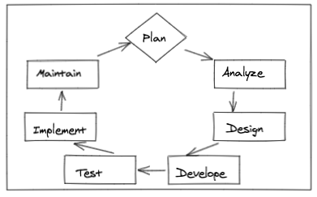

# SDLC -- Software Development Lifecycle
*questions to think about*

- Different forms of docmentation
- Why to document
- What to document
- What is wireframe
- Why wifreframe & examples

*What are some of the tools I need?*

- IDE
- Code
- Tests
- Github
- CI/CD

## SDLC indepth
____
- The SDLC is repeated over the lifetime of
an application; it’s used to create, update,
fix, and maintain the application.
- Each step in the cycle allows a company to
focus on producing the best application
possible.

<!-- 
Python 3 and pip <a href="https://youtu.be/K66ygx4JCls
" target="_blank"> Watch streaming https://youtu.be/K66ygx4JCls</a>
 -->

 <a href="./img/SDLC.png" target="_blank"> Phase of the SDLC</a>

## Quick Over of the SDLC Phase
___
The ultimate aim of the SDLC is to provide a roadmap to the customers solution. You can look at the phases as a series of questions and actions.
- Plan: What is the problem and who is going to solve it?
- Analyze: What do we want from a solution?
- Design: How will we get what we want?
- Develop: Let’s create what we want.
- Test: Did we get what we want?
- Implement: Let’s start using what we want.
- Maintain: Let’s get this closer to what we want.

 
There are many different methods to use within the SDLC, often known as Software developement process models. Some of the industry standards you may know are waterfall and Agile.

 <a href="./img/waterfall.png" target="_blank"> Waterfall process model</a>

 <a href="./img/agile.png" target="_blank"> Agile process model</a>

## Standards of Software Quality
___
- International Organization for Standardization (ISO)
- International Electrotechnical Commission (IEC)

Together, ISO and IEC create international standards for electronic
related technologies.

## Characteristics of a Good Quality Application
- Functionality
- Reliability
- Usability
- Efficiency
- Maintainability
- Portability

 <a href="./img/CGQA.png" target="_blank"> Characteristics of a Good Quality Application</a>

## Functionality
- Does the app fulfill its purpose?
- Modern apps have many distinct tasks that must all work together in order to provide a concise solution.
- Often times you must use many different systems together in order to help the client.
- Example: <ul>- Find Which products are available.</ul><ul>- Store a page for each product, include all available options, prices, reviews.</ul><ul>- Secure payment processing to protect user data.</ul><ul>- Provide accurate shipping estimate.</ul>

## Reliability
- Reliability measures risk and likelihood of application failures. It also measures defects
from modifications (stability).
- The goal is to reduce and prevent downtime of the application.
- An app that consistently locks up, crashes or freezes makes it difficult or impossible to
complete a task.
- Good architectural and coding practices are essential to mitigate most problems that
can affect an application’s reliability.

## Usability
- Is the application simple to understand and easy to use?
- How intuitive and responsive is the user interface (UI)?
- Which of these weather displays has better usability?

## Efficiency
- Is the application able to work fast enough?
- Does it take more resources to complete each task than it should?
- Does the application slow down the device or use excessive amounts of power?
- Efficiency is very important in areas where speed of execution matters, such as
transactions.
- The efficiency of an application is measured by checking and practicing good coding
practices.

## Maintainability
- If the application breaks, can we determine the problem and easily fix it?
- Maintainability also includes ideas such as: <ul>- How modular or reusable are the components?</ul><ul>- How easily are the components updated or changed?</ul><ul>- How easily can a new team member be brought up to speed on the project?</ul><ul>- Is the code clean and easy to read?</ul>

## Portability
- Portability is how easily the application or components of the application can be used
in different environments. When software with the same functionality is produced for
several platforms, portability is a fundamental issue for cost reduction.
- Examples are applications that are designed to run on multiple platforms such as
Windows, Mac, Android phones versus iPad, etc.

## Development Team Roles
___
- Project Manager<ul>- Responsible for developing a project plan.</ul><ul>- Recruit staff to fulfill other roles.</ul><ul>- Lead and manage the project team.</ul><ul>- Assign tasks to different team members.</ul><ul>- Determine a timeline for the project.</ul><ul>- Provide updates to upper management.</ul>

- Analyst<ul>- Sometimes called Business Analyst or Requirements
Analyst.</ul><ul>- Responsible for defining the purpose for each project.</ul><ul>- Gather requirements from leadership, clients, and/or
users.</ul><ul>- Organize requirements into tasks for the developers/QA
to use for implementation and testing.</ul>

- Quality Assurance<ul>- Create a list of tests that verify function, usability,
efficiency, maintainability, portability for each new
requirement.</ul><ul>- Maintain the list of tests that are necessary to verify the
behavior for each previously released feature.</ul><ul>- Run all of the tests and investigate any failures.</ul><ul>- Document the steps to replicate bugs or issues within
the application for the developers.</ul><ul>- Assists in creating the acceptance criteria. This is the
performance criteria used to measure successful
completion of the application.</ul>

- Software Developer<ul>- Write the actual code that makes up the application
according to the specifications given by the product
manager.</ul><ul>- Maintain previous versions of the application as long as they
are still supported.</ul><ul>- Run initial test cases to ensure the product works.</ul><ul>- Write code to fix and address bugs or other issues reported
to them.</ul>

- Database Administrator<ul>- Responsible for maintaining the data needed in the application.</ul><ul>- Responsible for planning, maintaining, and configuring access to that data. Ensure there are enough computing resources to make an application work properly.</ul><ul>- Responsible for the security of the data in the database.</ul><ul>- Responsible for backing up data (and restoring as needed).</ul><ul>- Responsible for database performance and optimization.</ul>

## Effective Software Teams
Due to the complexity of today’s software applications, they are usually
developed in teams. Effective collaboration can be the difference between a
successful project and one that fails.
Here are some general guidelines to follow:
- Translate goals into a clear definition of done.
- Prototype and iterate over designs.
- Use version control software to keep track of changes.
- Document important decisions and any required project knowledge
- Encourage two-way feedback
- Use time wisely

## SDLC Phases in more depth
___

 <a href="./img/SDLC1.png" target="_blank"> Planning Phase</a>

- Planning is the most fundamental and
critical portion of the SDLC.
- Many factors are taken into account at
this stage, including the economical,
operational, and technical aspects of
project implementation.
- Planning for quality assurance also
happens at this stage.

 <a href="./img/SDLC2.png" target="_blank"> Analyzing Phase</a>

- Product requirements are clearly
defined and documented.
- They are then approved by the
customer or the market analysis.
- Software Requirement Specification
(SRS) is a document containing all the
requirements necessary and will be
used at every subsequent step as a
reference tool.

 <a href="./img/SDLC3.png" target="_blank"> Design Phase</a>

- Using the SRS(software requirement specifications), different types of
architecture are evaluated for best use
in the project.
- More than one design approach is
created and proposed here. Referred
to as the design specification
document.
- The design options are reviewed for
risk, budget, and time constraints. The
best design is then selected.
- The design specification document can
contain functional descriptions, user
interface descriptions, and mockups of
screens.

 <a href="./img/SDLC4.png" target="_blank"> Developement Phase</a>

- The actual writing of the computer
code happens here. The product is
built.
- The code is written according to the
design document specification.
- The person writing the code must
follow guidelines according to their
organization and the language being
used. A few examples of common
languages are C++, Python, Java, and
Pascal. The language is chosen with
consideration to the type of software
being created.

 <a href="./img/SDLC5.png" target="_blank"> Testing Phase</a>

- One of the most important steps in
the development life cycle.
- Code can be written to test other
code. This process is called automation
testing.
- Common types of testing include:<ul>- Performance</ul><ul>- Load</ul><ul>- Unit functional tests</ul><ul>- Security</ul><ul>- Integration</ul><ul>- Regression</ul>

 <a href="./img/SDLC6.png" target="_blank"> Implementation Phase</a>

- Implementation is often called
deployment. This phase can be almost
invisible.
- The final approvals are given and the
application is released and becomes a
working piece of software.

 <a href="./img/SDLC7.png" target="_blank"> Maintainance Phase</a>

- Applications must be monitored
constantly to ensure operation.
- Updates to the application are often
done in response to defects, referred
to as bugs, discovered and reported
by users. Most bugs should be
discovered and fixed during the Test
phase as they are usually more
expensive to fix in the Maintain phase.
- Bug fixes may not go through the
entire SDLC, but steps are still
necessary to make sure the fix doesn’t
bring in other problems or issues.