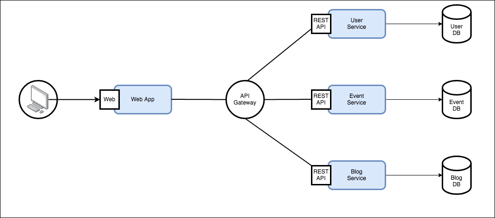

# LMTD Phase 1B - Project Two - Containerized Application

## Description 
## About Docker & Containers
## The Characteristics of Container Architecture

## About Our Project - devBops
DevBops is the next big platform for aspiring technologists. Users are able to RSVP to events related to technology happening across the world, and share pieces of writing relevant to technical topics of all varieties. 

Having had some time to deploy our application there are a number of ways we'll need to come together to improve upon it.

<!--  -->

### Project Tasks 
##### Team 1: Production Team 
Responsibilities: Maintain a highly available production environment, test, monitor and gather insight on the live application, handle bug tracking and error reporting, designing feature updates and documentation.

##### Team 2: Development Team
Responsibilities: Maintain a test-driven development environment. Implement bug fixes, new feature development, and codebase optimization with Containerized architectural patterns.

##### Team 3: QA / Sys Admin Team
Responsibilities: Staging development changes, automating the testing and monitoring of system infrastructure, creating continuous integration, delivery and deployment pipeline into production environment. Handle container security and configuration management.

##### Team 4: Technical Product Management
Your responsibilities are to ensure the project is delivered to client expectations by maintaining necessary documentation (code commits, comments, READMEs, API Documentation), organizing the team Kanban board and tracking issues, and leading the SCRUM planning and development alongside representatives from all the other teams.

## Milestones
* Automated Issue/Error Tracking via Github (or similar tool)

* Multiple Staging Environments (Dev, Production, QA)

* Docker Container Management

* Fully Deployed CI/CD Pipeline

* System Monitoring and Reporting 

* Highly Available / Fault Tolerant Best Practices

* Multiple Deployments to Production Environment

## Resources
